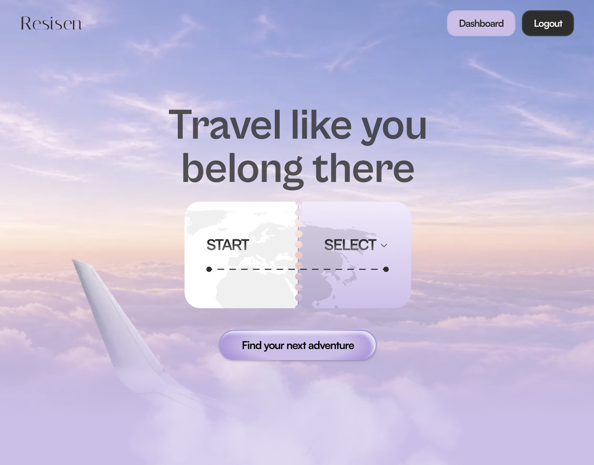

# Resisen

Browse verified experiences and destinations, get personalised recommendations and itinerary built around your interests and trip.



## Stack:

- Next.js 16 (App Router)
- React 19
- TypeScript
- Tailwind CSS 4
- shadcn/ui (Radix)
- Cloudinary

Integrates with the [Resisen backend API](https://github.com/reisenVogueTour/backend).

---

## Features

| Area                   | Capability                                                                                                     |
| ---------------------- | -------------------------------------------------------------------------------------------------------------- |
| **Auth**               | Register/login as customer or provider, role-based dashboard redirect                                          |
| **Discovery**          | Browse featured destinations & experiences, per-destination results with filters/search                        |
| **AI recommendations** | Describe your interests or personality in plain text and get matching experiences for a destination            |
| **AI itineraries**     | Turn recommended experiences into a sequenced itinerary, start it, and unlock checkpoints as you complete them |
| **Cart & bookings**    | Add experiences to a cart, submit booking requests, track status                                               |
| **Saved**              | Wishlist experiences, synced with the backend when logged in                                                   |
| **Provider**           | Apply with business details, track application status, manage listings and bookings from a dashboard           |
| **Admin**              | Review/approve/reject provider applications from an admin dashboard                                            |
| **Uploads**            | Cloudinary image uploads for images                                                                            |

---

## Prerequisites

- **Node.js** 20+
- **npm** 9+
- The [Resisen backend](../backend) running locally (or a deployed URL)
- A **Cloudinary** account configured on the backend, no frontend-side Cloudinary credentials needed
- Optional: a **Google Maps Embed API** key, for the map shown on experience/provider location details

---

## Getting started

### 1. Install dependencies

```bash
npm install
```

### 2. Configure environment

```bash
# see Environment variables below
```

### 3. Run the dev server

```bash
npm run dev
```

The app runs at **http://localhost:3000** and expects the backend at the URL set in `NEXT_PUBLIC_API_URL` (defaults to `http://localhost:5000`).

---

## Environment variables

| Variable                            | Required | Default                 | Description                                                                                      |
| ----------------------------------- | -------- | ----------------------- | ------------------------------------------------------------------------------------------------ |
| `NEXT_PUBLIC_API_URL`               | No       | `http://localhost:5000` | Base URL of the Resisen backend API                                                              |
| `NEXT_PUBLIC_GOOGLE_MAPS_EMBED_KEY` | No       | —                       | Enables the embedded map on experience/provider pages; leave blank to show a placeholder instead |

All variables are public (`NEXT_PUBLIC_*`) — there are no server-only secrets in this app, since it calls the backend directly from the browser.
